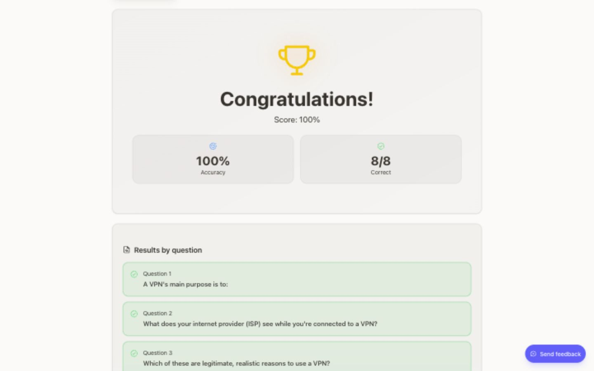
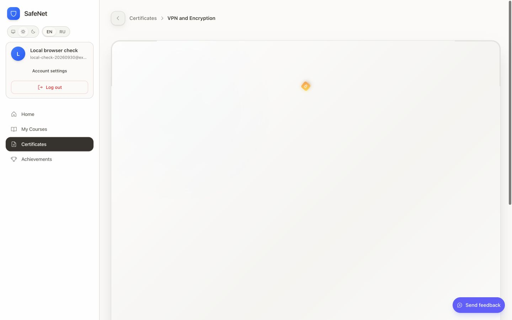

# Local verification — 2026-09-30

## Local application

- Web: http://localhost:3000
- API: http://localhost:4200
- PostgreSQL: localhost:5433, database `safenet`.
- Four pending migrations applied after a private backup in the ignored
  `_archive/local-backups` folder. Thirteen migrations are now applied.
- All nine pre-existing users remain. A separate synthetic `.test` learner was
  added for the browser check; existing accounts and their progress were not reset.
- Re-running `bun run setup` preserved environment files and reported no pending migrations.

## Evidence

| Check | Result |
| --- | --- |
| `bun run check` | Typecheck, lint and EN/RU parity passed |
| Final `bun run verify` | Checks, all configured test suites, secret scan, API/web/Guard builds and packaged ZIP passed |
| CI content checks | Legacy admin boundary, semantic colors and all 163 tasks / 21 tests validated |
| API regression suite | 15 suites / 98 tests passed |
| Isolated PostgreSQL/HTTP | Auth lifecycle, grading, XP concurrency, course snapshots, unique certificates, ownership and per-user persisted task completion passed |
| Fresh workspace install | `bun install --frozen-lockfile` succeeded without existing node_modules |
| Fresh extension build | Vite 6.4.3 with root React plugin override 4.7.0 succeeded |
| ZIP checks | SHA-256, manifests, EN/RU, privacy defaults and sender boundary passed |
| Browser course | Six VPN lesson tasks, eight test questions, 100%, detailed feedback, one certificate |
| Fresh tab | 6/6 tasks loaded from the server; an incorrect repeat retained completion |
| Local SMTP + HTTP | EN/RU verification, password reset, address-change confirmation and old-address notice delivered into Mailpit; links consumed and replay rejected |
| Configured SMTP | Existing Yandex SMTP connection and authentication succeeded; no real-recipient message sent |

The isolated integration database was removed after the checks. The main database
and running local application remain available. The local source commit is
`8d1b2dc`; it is unsigned because the configured 1Password signing executable is
absent. No persistent Git signing setting was changed and nothing was pushed.

## Remaining boundaries

- Official Chrome is installed. Loading the unpacked Guard requires confirmation
  because it grants access to tab URLs and site contents. No installed Guard
  privacy/upgrade result is claimed.
- A real-recipient delivery test needs the user's test email address.
- The browser tool rejected injection for simulating absent Web Locks; the real
  IndexedDB fallback, private-mode and replay browser cases remain open.
- Old hosted CI failure: missing pydantic and incompatible React/Vite versions.
  Both configuration causes were corrected locally. Workflow now supports manual
  dispatch and includes SMTP regression checks, but the new code has not been pushed.
- Screen-reader speech, reduced motion, offline behavior, restore and production
  load remain separate acceptance work.
